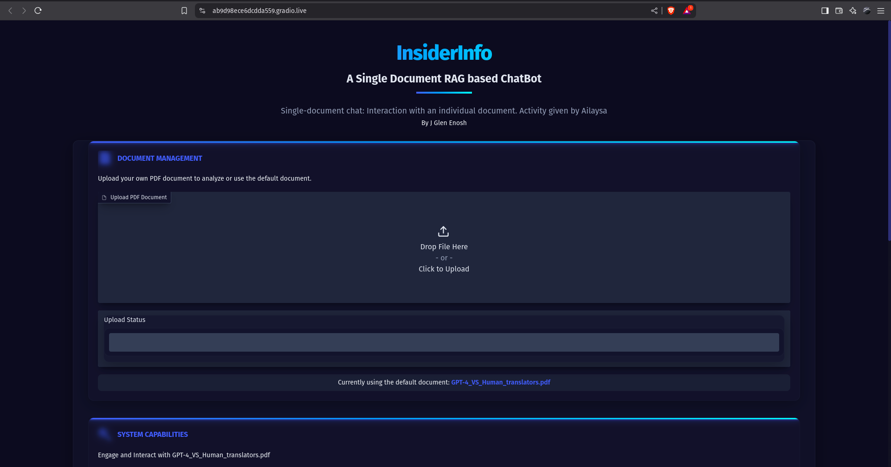
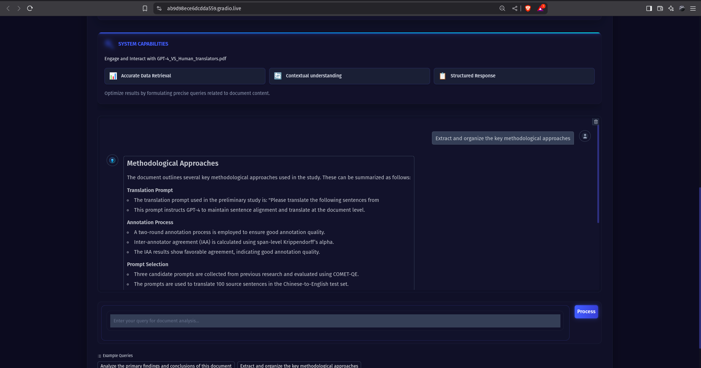
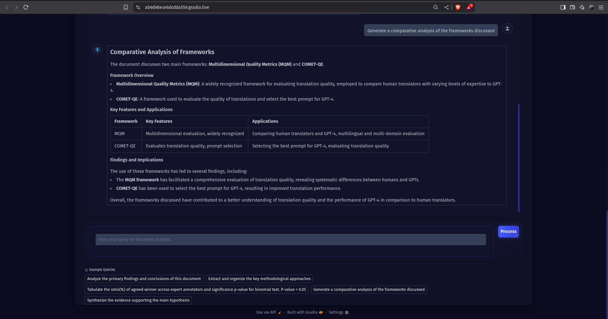

# InsiderInfo: RAG-based Document Q&A System

A professional, futuristic document analysis and Q&A system that allows users to interact with PDF documents through natural language queries. The application features a modern dark-themed UI, optimized retrieval and response generation, and support for custom document uploads.



## Key Features

- **Single Document RAG System**: Interact with individual PDF documents using natural language queries
- **Custom Document Upload**: Upload your own PDF documents and query them instantly
- **Optimized Performance**: Caching mechanisms and optimized retrieval parameters for faster responses
- **API Key Load Balancing**: Round Robin load balancing across multiple API keys to prevent rate limiting
- **LLM Fallback Mechanism**: Automatic fallback to Google Gemini when Groq encounters issues
- **Professional UI**: Modern dark-themed interface with responsive design and futuristic elements
- **Structured Responses**: Well-formatted answers using tables, lists, and other Markdown elements
- **Example Queries**: Pre-defined example queries to help users get started

## Tech Stack

- **Backend**:
  - Python 3.10+
  - LangChain for document processing and RAG pipelining
  - Groq with Llama 3.3 70B for primary AI responses
  - Google Gemini for fallback AI responses
  - Google text-embedding-004 model for document embeddings
  - ChromaDB for vector storage
  - dotenv for environment variable management

- **Frontend**:
  - Gradio for the web interface
  - Custom CSS for styling
  - SVG graphics for avatars and UI elements

- **Performance Optimizations**:
  - Database instance caching
  - Query result caching
  - LRU chain caching
  - Optimized chunk sizes and retrieval parameters
  - API key load balancing (based on Round Robin)

## Setup Instructions

### Prerequisites

- Python 3.12 or higher
- pip (Python package manager)
- Groq API key (for primary LLM)
- Google Gemini API key(s) (for fallback when Groq encounters issues)

### Installation

1. Clone the repository:
   ```bash
   git clone https://github.com/yourusername/RAG_to_Riches.git
   cd RAG_to_Riches
   ```

2. Create and activate a virtual environment:
   ```bash
   python -m venv .venv
   source .venv/bin/activate  # On Windows: .venv\Scripts\activate
   ```

3. Install the required packages:
   ```bash
   pip install -r requirements.txt
   ```

4. Create a `.env` file in the root directory with your API keys and document path:
   ```
   GROQ_API_KEY = 'your_groq_api_key'
   GEMINI_API_KEY_1 = 'your_api_key_1'
   GEMINI_API_KEY_2 = 'your_api_key_2'
   GEMINI_API_KEY_3 = 'your_api_key_3'
   GEMINI_API_KEY_4 = 'your_api_key_4'
   GEMINI_API_KEY_5 = 'your_api_key_5'
   DOC_PATH = 'path_to_your_default_document.pdf'
   CHROMA_PATH = 'chroma'
   ```
   Note: You can use a single API key by only defining `GEMINI_API_KEY_1`.

5. Place your default PDF document in the location specified by `DOC_PATH` in your `.env` file.

### Running the Application

1. Start the application:
   ```bash
   python main.py
   ```

2. Open your browser and navigate to:
   ```
   http://127.0.0.1:7860
   ```

## Usage

### Querying Documents

1. Enter your question in the input field at the bottom of the interface
2. Click "Process" or press Enter to submit your query
3. View the structured response in the chat area

### Uploading Custom Documents

1. Click the "Upload PDF Document" button in the Document Management section
2. Select a PDF file from your computer
3. Wait for the document to be processed (a success message will appear)
4. Start asking questions about your uploaded document
5. To return to the default document, click "Use Default Document"

## Project Structure

```
RAG_to_Riches/
├── main.py                 # Main entry point
├── .env                    # Environment variables
├── requirements.txt        # Dependencies
├── uploads/                # Directory for uploaded documents
├── chroma/                 # Vector database storage
└── src/
    ├── config/             # Configuration settings
    │   └── settings.py
    ├── database/           # Document storage and retrieval
    │   └── document_store.py
    ├── ui/                 # User interface components
    │   ├── app.py          # Gradio interface
    │   ├── styles.py       # CSS styling
    │   └── assets/         # UI assets (avatars, etc.)
    └── utils/              # Utility functions
        ├── api_load_balancer.py  # API key load balancing
        └── query_handler.py      # Query processing
```

## UI Components

The application features a modern, dark-themed interface:

### Query Interface


### Tabular Response


## Performance Optimizations

The system includes several optimizations to improve response time and user experience:

1. **Database Optimizations**:
   - Caching of database instances
   - Optimized chunk size (800 characters) and overlap (100 characters)
   - Document-specific database paths

2. **Query Processing Optimizations**:
   - Query result caching for instant responses to repeated questions
   - LRU caching for the prompt-LLM chain
   - Optimized LLM parameters for faster generation
   - Relevance score thresholding (0.2) for better results

3. **API Key Management**:
   - Round Robin load balancing across multiple Google Gemini API keys
   - Thread-safe implementation for concurrent requests
   - Automatic fallback to Google Gemini LLM when Groq encounters issues

4. **LLM Fallback Mechanism**:
   - Primary use of Groq's Llama 3.3 70B model for high-quality responses
   - Automatic detection of Groq API errors
   - Seamless transition to Google Gemini as a fallback
   - Comprehensive error handling for both primary and fallback LLMs
   - Transparent logging of LLM switching for monitoring

## License

[MIT License](LICENSE)

## Acknowledgments

- This project uses Groq API with Llama 3.3 70B as the primary LLM
- Uses Google Gemini API as a fallback LLM
- Built with LangChain and Gradio
- Inspired by the need for efficient document analysis tools
